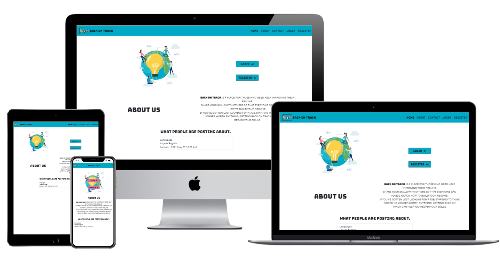

# Back On Track

**Code Institute - Milestone Project 3**

[View webpage in GitHub Pages](https://github.com/maxthor500/Back-on-track-MS3)



This project is the third Milestone Project that make up the Full Stack Developer course at the Code Institute.

This project aims to build a full-stack web application using the python micro-framework Flask, MongoDB database.

**BACK ON TRACK** is a place for those who need help improving their resume. Share their skills with others so that everyone can advise on how to build own resume. If you've gotten lost looking for a job, starting to think you're no longer worth anything, getting back on track can help you regain your skills.

[Click here to see the website live](https://career-back-on-track.herokuapp.com/home)

## User Experience

### User Stories

- As a user I am looking for a responsive web design so that I can display content of website adequately     to the device.
- As a new user, I would like to know what the website is about upon opening the site.
- As a new user I am looking for some help from another people to organize my curriculum vitae 
- As a new user I can see examples of posts have been putted on site. 
- As a new user, I would like to easily register and login for the site.
- As a user I can save my username and password so I can easily enter to the site. 
- As a new user I can create save password following the requirements of the website. 
- As a user, I would like to login and add a new post to the blog.
- As a user I can contact by email or phone the website founder so that I can send him a message if I     want to know more about the website.
- As a user I can check when the post has been posted and by whom. 
- As a user I can answer other users and give them advice. 
- As a user I can delete my comments under a post. 
- As a user I can create, edit, delete or comment my post. 
- As a new user I can check on map where is located the website founder. 

### Strategy

My design goal is to make up everything the information as easy as possible making the UX simple and fun.

### Scope

The website is a place where the user shares his curriculum with others to take stock of the situation on his abilities.

### Structure

I started developing my wireframes using Balsamiq for each page on mobile, tablet and laptop/desktop.

### Skeleton

*  [Wireframes](./assets/wireframes/ms3-wireframes2.pdf) PDF file.


### Surface

I next moved onto the design work of the website.

##### Colour Scheme

The colours are inspired by the Hero Image and used the following palette from [ColorSpace](https://mycolor.space/):


##### Typography

I used Google Fonts to select the fonts for my project.
The' Bungee' font is the font used on the navbar, the buttons and the headers, with cursive as the fall-back font in the case for any reason the font isn't being imported into the site correctly.

I chose this font because the stroke looks like a Japanese kanji, in my opinion.

I used the 'Roboto' font for every text in the body with sans-serif as the fall-back font, with the main font the reading seemed too thoughtful.

##### Imagery

I made the BOT logo, an hero image made from my cousin [AriannaDiBiaseEventi](https://www.instagram.com/ariannadibiaseventi/ ), and adapted and rendered vector with [Inkscape](https://inkscape.org/).


### Database Models and Schema

  #### Database Models

   - My database consists of four collections.
      - Users
        - Posts
        - Categories
        - Comments.

  - Users
    - The Users collection contains information about the user.

  - Posts 
    - The Posts model contains the information for each post.
    - It also contains a relationship with the user for the Post author field.
    - It also contains a relationship with the category model for each post.

  - Categories
    - The category model contains a category name which and id which is then referenced in the posts model.

  - Comments.
    - The comments Model contains each comment's content and date.
    - It then contains a reference to the users id who wrote the post.
    - It then also contains a reference to the id for the post, it belongs too.


#### Database Schema

  - My database schema is shown in the following diagram.

    


#### MogoDb

- [Mongodb](https://www.mongodb.com/)

 - mongodb was used as the project database. 
  - I followed the following steps to set it up.

    - I signed up to Mongodb and selected the create a shared cluster option.
    - I selected Aws as my cloud provider and then selected my region.
    - Then I selected The M0 cluster tier.
    - I then named my cluster and created it. 
    - Once the cluster was created I clicked on database access and added in the database user details.
    - Then I set the database user privileges to read and write to the database.
    - I then clicked add a user.
    - Then in the security menu, I clicked on network access.
    - Then click on the add IP address.
    - I then allowed access from anywhere.
    - Now we can start to add collections.
    - I clicked on add my own data and then named my database and collection.
    - To connect to the database I clicked on the connect button then the connect your application button.
    - Then I copied the Url and placed in within an environmental variable in my app.
    - I then used PyMongo to interact with my database from the application.

## Features

#### Main feautures

- #### Home page

  - When a user opens the site they are presented with the landing page.

  - It contains a clear title and information about the application.

  - There are also links to signup or login.

  - There is an about us section and there is a section showing the last three posts that have been posted.

  - The navigation menu has been made with Bootstrap 5.

    


#### About Us page.

- The about us page gives the user information about the site.

- In this page the users can to find the company details and a map rendered with LeafletJS

  


#### Contact us page.

- The contact us page contains a heading and a contact form.

- Upon submittal of the form EmailJS will send the site owner an email containing the message and the user's contact information.

  

  #### Registration.

  - The registration page contains a form for users to sign up.

  - Once the user fills the form and submits their details are stored in the database.

    

    

    #### Login

    - The login page contains a form for the user to login.
    - Once the user enters the correct details they are logged in and redirected to home page that render the recent posts page.

    

    #### Home page when the user is logged

    - When the user is logged is able to see every posts from the home page.

    - the home page shows every posts and a share post button to link to add post page

      

    #### Profile

    - The profile page shows the user details and his posts
    - there are an update and delete button to update the profile details and delete account

    

    #### Form

    - Every forms are pretty similar as functionality.

    - the forms have a header to indicate the purpose of the form.

    - every inputs have a label or a placeholder to help the user.

    - the submits flash a message for "successfully " or  "something wrong".

    - add post  and edit post pages have a share button checked by default, if the post is not shared the user cans see it just on his profile page.

      

      

      - the user can update the details of his profile changing email address, linkedin url and website url.

      

      

      - the delete account page ask to insert the password to confirm.

      

      

    - the user add the comments from a page to render the posts with every comments already posted.

      

      

      - after the comment is posted the user cans just delete his post.
      - I preferred not implement a edit comment button because it is the same delete and add a new.

      

      

      - the flash messages are rendered as span on the top of the page

      

    #### Error 404 page

    


### Features left to Implement

I had few time for this project, during this period I changed house and job so that I was not able to implement all my ideas and in the future, I would like:

* to add a flex footer with contact form, site map and info and map.
* to add the functionality so the user can add an profile's image.
* to implement [cloudinary](https://cloudinary.com/) for share video and image.
* to add a change password form.
* to add a logic for like and dislike.
* to add a form email to reset forget password.
* to add an search post functionality on the navbar.
* to add the functionality of follow the users and will be able to see other profile.
* to add a navbar animation.
* to add an admin to manage categories.

## Technologies used

**Languages, libraries, frameworks, editors and version control**

* HTML5
  * The language used to create the form and add content to the website.
* CSS3
  * The language used to style the HTML5 elements.
* JavaScript
  * JavaScript was used throughout the website to make the site interactive.
* Python
  * Python was used to build the backend functionality of the web app.
* [Font Awesome](https://fontawesome.com)
* [Bootstrap 5](https://getbootstrap.com/docs/5.0/getting-started/introduction/) used for every the component of the website.
* [EmailJS](https://www.emailjs.com/) to make the form interactive.
* [LeafLetJS](https://leafletjs.com/) to render the map 
* [JQuery](https://jquery.com/)
* Visual Studio Code
* [Gitpod](https://www.gitpod.io/)
  * I used Gitpod's development environment to write the code for the website.
* [Git Version Control](https://git-scm.com/)
  * I used Git for Version Control to record changes and updates to my files
* [GitHub](https://github.com/)
  * I used GitHub’s repository hosting service to host my deployed website as well as track previous versions of my code 

**Other tools used:**

* [Balsamiq](https://balsamiq.com/)
  * I used Balsamiq to create wireframes for my project for desktop, tablet and smartphone.
* [Google Images](https://www.google.com/images)
  * This was the source for the images in my project.
* [Google Fonts](https://fonts.google.com/)
* [dbdiagram.io](https://dbdiagram.io/home)
  - I used dbdiagram.io to make a diagram of my database schema.
* [W3Schools](https://www.w3schools.com/css/default.asp)
  - It was helpful with all my CSS doubts.
* [Techsini](http://techsini.com/multi-mockup/index.php)
  - Techsini was used to taking screenshots of the page at different screen sizes.
* [AutoPrefixer](https://autoprefixer.github.io/)
  - This project used **AutoPrefixer** to make sure the CSS code is valid for all browsers.
* [Typora](https://typora.io/)
* [Chrome DevTools](https://developers.google.com/web/tools/chrome-devtools)

*Note: I also found [Stack Overflow](https://stackoverflow.com/), [W3C Schools](https://www.w3schools.com/) and [MDN Web Docs](https://developer.mozilla.org/en-US/) helpful resources throughout the project, as well as the Code Institute Slack Community. 

#### FLASK and extension used

- [Flask](https://flask.palletsprojects.com/en/1.1.x/)

  - Flask micro framework was used to build the web app using python code.

- [Flask-bcrypt](https://flask-bcrypt.readthedocs.io/en/latest/)

  - Flask bcrypt was used to has the users password before storing it in the database.

- [Pymongo](https://pymongo.readthedocs.io/en/stable/index.html)

  - Pymongo was used to interact with the database.

- [Flask-Wtf](https://flask-wtf.readthedocs.io/en/stable/)

  - Flask-Wtf was used to created the forms and validate them.

  


## Testing

Testing information can be found in separate [TESTING.md](TESTING.md) file.


## Deployment

This project was developed using the [Gitpod](https://www.gitpod.io/) at the begin and following with Visual Studio Code, committed to git and pushed to GitHub using the built-in function within git.

To deploy this page to GitHub Pages from its [GitHub repository](https://github.com/maxthor500/Hirakudo-Academy), the following steps were taken:

1. Log into GitHub.
2. From the list of repositories on the screen, select **maxthor500/Back-on-track-MS3.
3. From the menu items near the top of the page, select **Settings**.
4. Scroll down to the **GitHub Pages** section.
5. Under **Source** click the drop-down menu labelled **None** and select **Master Branch**
6. On selecting Master Branch the page is automatically refreshed, the website is now deployed.
7. Scroll back down to the **GitHub Pages** section to retrieve the link to the deployed website.

**How to run this project locally**

To clone this project into Gitpod you will need:

1. A GitHub account. [Create a Github account here](https://github.com/)
2. Use the Chrome browser

Then follow these steps:

1. Install the [Gitpod Browser Extensions for Chrome](https://www.gitpod.io/docs/browser-extension/)
2. After installation, restart the browser
3. Log into [Gitpod](https://gitpod.com/) with your Gitpod account.
4. Navigate to the [Project GitHub repository](https://github.com/maxthor500/Hirakudo-Academy)
5. Click the green "Gitpod" button in the top right corner of the repository
6. This will trigger a new Gitpod workspace to be created from the code in GitHub where you can work locally.

To work on the project code within a local IDE such as VSCode, Pycharm etc:

1. Follow this link to the [project GitHub repository](https://github.com/maxthor500/Finding-Campania).
2. Under the repository name, click "Clone or download".
3. In the Clone with HTTPs section, copy the clone URL for the repository.
4. In your local IDE open the terminal.
5. Change the current working directory to the location where you want the cloned directory to be made.
6. Type `git clone`, and then paste the URL you copied in Step 3.

```
git clone https://github.com/USERNAME/REPOSITORY
```

1. Press Enter. Your local clone will be created.

Further reading and troubleshooting on cloning a repository from GitHub [here](https://help.github.com/en/articles/cloning-a-repository).

#### Heroku

- The project has been deployed on heroku. To achieve this I followed the following steps.

1. Create a requirements.tx file typing the following command into your terminal. 

   ```
       pip3 freeze --local > requirements.txt
   ```

2. Then create the procfile by typing the following comand into the terminal.

   ``` 
      echo web: python app.py > Procfile
   ```

3. Once your procfile has been created make sure there is no blank line at the end of the procfile as it can cause isssues if there is.

4. Signin to Heroku.com and select new button then the create a new app option.

   

5. Then name your app and select your region. Your name must be unique.

   

6. Then click the create app button.

7. On the next screen click the connect to github buttton.

8. Then add your projects repository name and search for it.

   

9. Once the repository has been found click connect button.

10. Then click on the setting button
        

11. Then click on the reveal config variables button.


12. Add your config variable key values to this section.

    

13. Confirm that both your Procfile and your requirements have been commited and pushed to github.


14. Then enable automatic deploys and then click the deploy branch button.

    

15. Heroku will now build and deploy your application. It will also automatically update it everytime you add a commit to your github repository.

## CreditsMedia

#### 	Code

- from [Spencer Barriball](https://github.com/5pence/recipeGlut)  I used to code to login and registration forms.
- from [BrianWhelanDublin](https://github.com/BrianWhelanDublin/milestone-project-3) I used to write my readme


#### 	Acknowledgements

I would like to thank the following:

* My mentor, **Spencer Barriball**, for his guidance, wisdom and encouragement throughout the project.
* **CI Staff** and **Slack Community** for their assistance with minor coding issues.
* My fiancée, **Vanessa** and my sister **Rosita** for the users stories.
* My cousin [AriannaDiBiaseEventi](https://www.instagram.com/ariannadibiaseventi/ ) for the hero image

**The content of this website is for educational purposes only.**

Thanks for taking the time to view my README. I hope you enjoyed your visit to my page.
